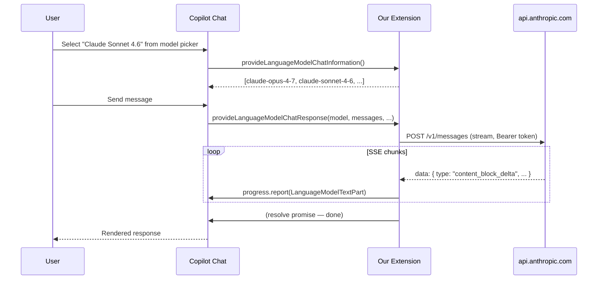

# VS Code Language Model Chat Provider API

**Date:** 2026-07-10
**Status:** ✅ Researched
**Source:** [VS Code API Reference](https://code.visualstudio.com/api/references/vscode-api), [Language Model Guide](https://code.visualstudio.com/api/extension-guides/language-model)

---

## Overview

VS Code exposes a **finalized** API that lets extensions register custom language models. These models appear in the Copilot Chat model picker natively — users select them just like built-in Copilot models. This is exactly the integration point for our extension.

---

## 1. Core API: `vscode.lm`

### Registration
```typescript
namespace vscode.lm {
  function registerLanguageModelChatProvider(
    vendor: string,
    provider: LanguageModelChatProvider<LanguageModelChatInformation>
  ): Disposable;
}
```

### Model selection (used by Copilot Chat)
```typescript
function selectChatModels(
  selector?: LanguageModelChatSelector
): Thenable<LanguageModelChat[]>;
```

### Events
```typescript
const onDidChangeChatModels: Event<void>;
```

---

## 2. `LanguageModelChatProvider<T>` Interface

```typescript
interface LanguageModelChatProvider<T extends LanguageModelChatInformation> {
  provideLanguageModelChatInformation(
    options: PrepareLanguageModelChatModelOptions,
    token: CancellationToken
  ): ProviderResult<T[]>;

  provideLanguageModelChatResponse(
    model: T,
    messages: readonly LanguageModelChatRequestMessage[],
    options: ProvideLanguageModelChatResponseOptions,
    progress: Progress<LanguageModelResponsePart>,
    token: CancellationToken
  ): Thenable<void>;

  provideTokenCount(
    model: T,
    text: string | LanguageModelChatRequestMessage,
    token: CancellationToken
  ): Thenable<number>;
}
```

### Key points
- `provideLanguageModelChatInformation` → returns the model list shown in picker
- `provideLanguageModelChatResponse` → **streaming** response via `Progress<T>`
- `provideTokenCount` → optional, for token estimation
- `PrepareLanguageModelChatModelOptions` has `silent: boolean` flag

---

## 3. `LanguageModelChatInformation` Shape

```typescript
interface LanguageModelChatInformation {
  id: string;              // Unique model ID (e.g. "claude-sonnet-4-6")
  name: string;            // Display name
  family: string;          // Model family (e.g. "claude-4")
  version: string;         // Version tag
  vendor: string;          // Must match registration vendor
  maxInputTokens: number;  // Context window
  maxOutputTokens: number; // Max generation
  capabilities?: LanguageModelChatCapabilities;
  detail?: string;
  tooltip?: string;
}

interface LanguageModelChatCapabilities {
  imageInput?: boolean;
  toolCalling?: number | boolean;
}
```

---

## 4. Message Types

### Request messages (from Copilot Chat → provider)
```typescript
interface LanguageModelChatRequestMessage {
  role: LanguageModelChatMessageRole;  // User: 1, Assistant: 2
  content: readonly unknown[];
  name: string;
}
```

### Response parts (provider → Copilot Chat via progress)
```typescript
type LanguageModelResponsePart =
  | LanguageModelTextPart
  | LanguageModelToolCallPart
  | LanguageModelDataPart;
```

The provider calls `progress.report(part)` for each chunk.

---

## 5. `ProvideLanguageModelChatResponseOptions`

```typescript
interface ProvideLanguageModelChatResponseOptions {
  modelOptions?: object;  // model-specific options
  toolMode?: LanguageModelChatToolMode;
  tools?: readonly LanguageModelChatTool[];
}

interface LanguageModelChatTool {
  name: string;
  description: string;
  inputSchema?: object;
}
```

---

## 6. Contribution Point: `languageModelChatProviders`

In `package.json`:
```json
{
  "contributes": {
    "languageModelChatProviders": [
      {
        "vendor": "claude",
        "displayName": "Claude (Subscription)",
        "configuration": {
          "type": "object",
          "properties": {
            "oauthToken": {
              "type": "string",
              "secret": true,
              "description": "Generate via: claude setup-token"
            }
          }
        }
      }
    ]
  }
}
```

### Properties
| Property | Required | Description |
|---|---|---|
| `vendor` | ✅ | Unique ID, must match `registerLanguageModelChatProvider` first arg |
| `displayName` | ✅ | Human name in model picker |
| `configuration` | ❌ | JSON schema for provider config; `"secret": true` → SecretStorage |
| `managementCommand` | ❌ | Deprecated, use `configuration` instead |
| `when` | ❌ | Context clause to show/hide provider |

---

## 7. Authentication Integration

### Option A: `configuration` with secret field (RECOMMENDED)
- VS Code handles storage securely via SecretStorage
- User enters token via "Add Models..." flow
- Token passed in `options.configuration` to provider methods

### Option B: `contributes.authentication` + AuthenticationProvider
- Register full auth provider
- More complex, native login/logout UI
- Better for OAuth flows

### Our choice: Option A
Simpler, sufficient for token-paste approach. Can upgrade to Option B later for true OAuth.

---

## 8. How Copilot Chat Calls the Provider



---

## 9. Agent Mode & Tool Calling

Copilot Chat Agent Mode (and Copilot CLI / Agents window) automatically:
- Sends `tools` array to `provideLanguageModelChatResponse`
- Expects `LanguageModelToolCallPart` in response stream
- Handles tool execution loop natively

Our provider needs to:
1. Forward `tools` to Anthropic API as `tools` array
2. Parse `tool_use` content blocks from Anthropic response
3. Report as `LanguageModelToolCallPart` via progress

---

## 10. Capabilities Declaration

```typescript
const model: LanguageModelChatInformation = {
  id: "claude-sonnet-4-6",
  name: "Claude Sonnet 4.6",
  vendor: "claude",
  family: "claude-4",
  version: "4.6",
  maxInputTokens: 200000,
  maxOutputTokens: 64000,
  capabilities: {
    imageInput: true,       // Vision support
    toolCalling: 2,         // Parallel tool calls
  },
};
```

---

## 11. Reusable Patterns from `opencode-copilot-chat`

The sibling project already implements this API for OpenCode gateway:

| File | Reuse | What it does |
|---|---|---|
| `src/extension.ts` | ✅ Pattern | `registerLanguageModelChatProvider` registration |
| `src/streaming.ts` | ✅ Code | `streamAnthropicMessages()` SSE handler + `AnthropicResponseExtractor` |
| `src/metadata.ts` | ✅ Pattern | Model metadata resolution |
| `src/chatParts.ts` | ✅ Code | DataPart/tool-call construction |
| `package.json` | ✅ Pattern | `languageModelChatProviders` contribution |

---

## References

- [Language Model API Guide](https://code.visualstudio.com/api/extension-guides/ai/language-model)
- [VS Code API — `vscode.lm`](https://code.visualstudio.com/api/references/vscode-api#lm)
- [Contribution Points — `languageModelChatProviders`](https://code.visualstudio.com/api/references/contribution-points#contributes.languageModelChatProviders)
- Sibling project: `/Users/ltmoerdani/Startup/opencode-copilot-chat`
